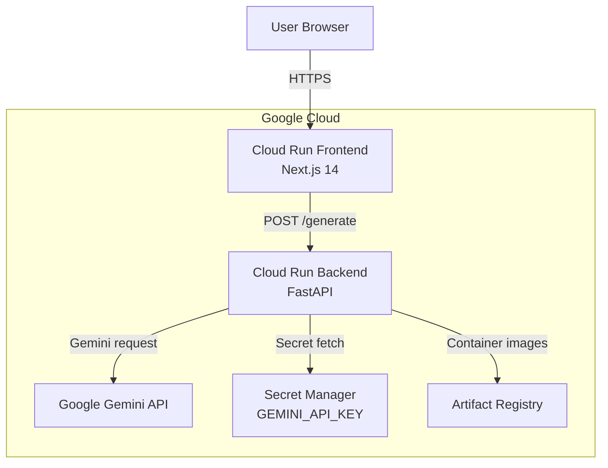

# Architecture Blueprint

> Version 1.0 – updated after end-to-end deployment.

## Components

- **Frontend (`frontend/`)**
  - Next.js 14, Tailwind CSS, deployed to Cloud Run.
  - Uses `NEXT_PUBLIC_API_BASE_URL` to call backend over HTTPS.

- **Backend (`backend/`)**
  - FastAPI application with `/health` and `/generate` routes.
  - Wraps Google Gemini via `google-generativeai` SDK.
  - Runs on Cloud Run with environment managed through Secret Manager.

- **Infrastructure (`infra/terraform/`)**
  - Terraform modules for Artifact Registry, Cloud Run services, IAM, and secrets.
  - Supports reproducible provisioning of staging/production environments.

## Data Flow

1. User submits event notes in the frontend.
2. Frontend issues POST `/generate` to the backend Cloud Run service.
3. Backend builds a structured prompt and calls Gemini.
4. Gemini returns draft content; backend normalizes into donor/social/checklist content.
5. Response is rendered in the UI with copy-to-clipboard helpers.

## Security & Config

- Secrets (e.g., `GEMINI_API_KEY`) stored in Secret Manager and injected at deploy time.
- CORS configured to allow the Cloud Run frontend domain.
- Docker images stored in Artifact Registry; Cloud Run revisions pinned to specific tags.
- Cloud Logging captures request/response metadata for both services.

## Deployment Strategy

- Local development via `uvicorn` and `next dev` with `.env` files.
- Multi-stage Docker builds pushed with `docker buildx` targeting `linux/amd64`.
- Cloud Run deployed with `gcloud run deploy` (frontend and backend services).
- Documentation and submission artifacts live in `docs/`.

